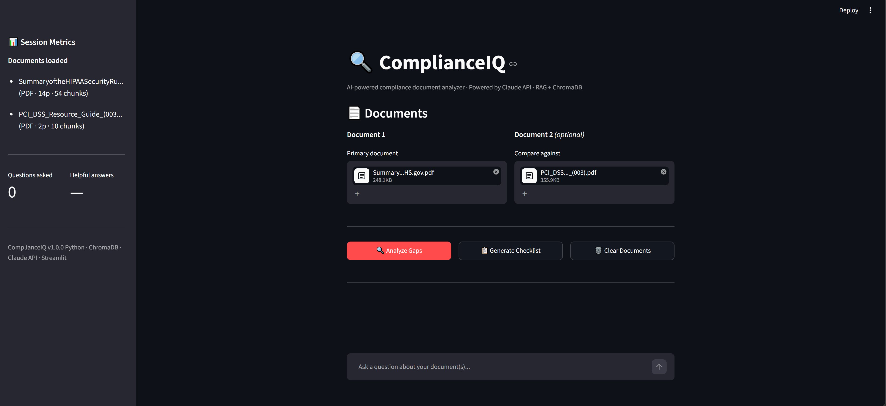
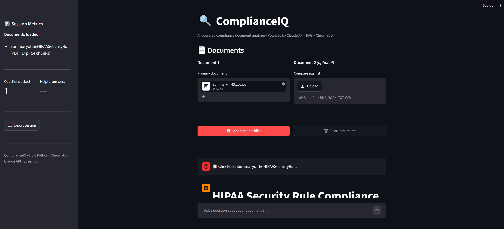
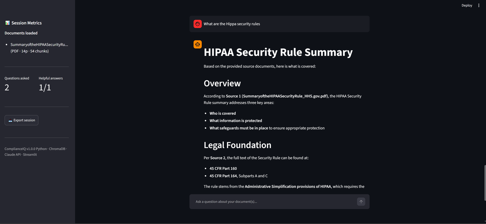
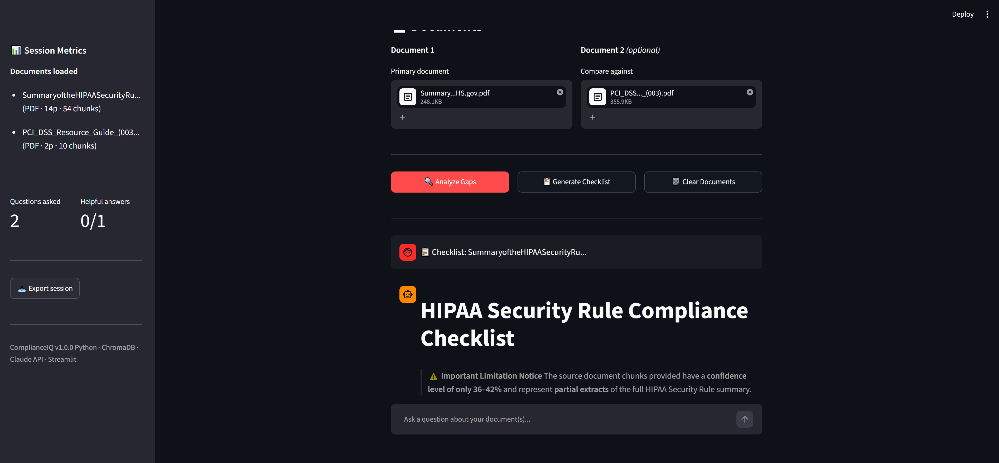
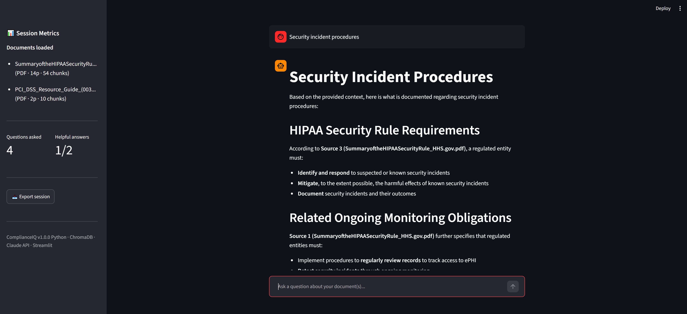

# 🔍 ComplianceIQ

**AI-powered compliance document analyzer.** Upload compliance documents, ask questions in plain English, auto-generate requirement checklists, and run gap analysis between two documents — grounded in your own files using Retrieval-Augmented Generation (RAG).



Built with Python, Streamlit, ChromaDB, and the Anthropic Claude API.

> **Status:** Working prototype / portfolio project. It runs end-to-end and is fully usable as a single-user demo. See [Known Limitations](#known-limitations--production-roadmap) for what would need hardening before a real multi-user deployment — being explicit about that boundary is intentional.

---

## What it does

- **📄 Multi-format ingestion** — PDF, DOCX, TXT, and CSV.
- **💬 Grounded Q&A** — ask questions and get answers drawn *only* from the uploaded documents, with the model instructed to say "I don't have that information" rather than guess.
- **📋 Checklist generation** — extract requirements (`shall` / `must` / `required`) and format them as an actionable checklist.
- **🔍 Gap analysis** — compare two documents and surface requirements present in one but missing from the other, with a risk assessment.
- **👍👎 Feedback & metrics** — rate answers; the sidebar tracks question count, average latency, retrieval confidence, and helpfulness ratio.
- **📥 Session export** — download the full Q&A transcript as a text file.

---

## Architecture

The project is deliberately decomposed into single-responsibility modules. The vector store sits behind a repository interface, so swapping ChromaDB for pgvector/Pinecone touches one file.

```
complianceiq/
├── app.py                 # Streamlit UI + orchestration
├── config.py              # Single source of truth for all constants
├── core/
│   ├── ingestion.py       # Multi-format text extraction (factory pattern)
│   ├── chunking.py        # Document-aware chunking (strategy pattern)
│   ├── retrieval.py       # ChromaDB repository — vector store abstraction
│   ├── ai_engine.py       # All Claude API calls + RAG prompt construction
│   └── security.py        # Input validation (file type/size, question checks)
├── utils/
│   ├── logger.py          # Structured JSON logging with rotation
│   └── metrics.py         # Session + per-query metrics
└── tests/                 # pytest suite (chunking, ingestion, retrieval, security)
```

**Key design decisions**

- **Repository pattern for retrieval** — nothing outside `retrieval.py` knows ChromaDB exists, so the vector backend is swappable.
- **Chunking as a strategy, not an afterthought** — sentence-aware splitting (regex-based, O(n)) for large legal documents, row-based chunking for CSVs that repeats column headers in every chunk, and character-based splitting with overlap for everything else.
- **Grounded retrieval** — cosine-similarity search returns the top chunks, which are injected into a system prompt that constrains the model to the provided context to reduce hallucination on compliance content.
- **Operability built in** — structured JSON logging, rotating log files, an input-validation layer, and a test suite.

---

## Tech stack

| Layer | Technology |
|---|---|
| UI | Streamlit |
| LLM | Anthropic Claude (`claude-sonnet-4-6`) |
| Vector store | ChromaDB (cosine similarity) |
| PDF parsing | PyMuPDF |
| DOCX parsing | python-docx |
| Tabular | pandas / openpyxl |
| Testing | pytest |

---

## Getting started

### Prerequisites
- Python 3.10+
- An Anthropic API key ([console.anthropic.com](https://console.anthropic.com))

### 1. Clone and install
```bash
git clone https://github.com/manasaghattamaneni/complianceiq.git
cd complianceiq
pip install -r requirements.txt
```

### 2. Configure your API key
Copy the example secrets file and add your key:
```bash
cp .streamlit/secrets.toml.example .streamlit/secrets.toml
```
Then edit `.streamlit/secrets.toml`:
```toml
ANTHROPIC_API_KEY = "sk-ant-..."
```
> `.streamlit/secrets.toml` is gitignored and will never be committed.

### 3. Run
```bash
streamlit run app.py
```
The app opens at `http://localhost:8501`.

### 4. Run the tests
```bash
pytest -v
```

---

## How it works (request flow)

1. **Upload** → file is validated (type + size), text is extracted by the format-specific reader.
2. **Chunk** → the text is split using the strategy appropriate to its type and size.
3. **Index** → chunks are embedded and stored in a ChromaDB collection.
4. **Ask** → the question is validated, the top relevant chunks are retrieved by cosine similarity, and a grounded prompt is sent to Claude.
5. **Answer** → the response is returned with source attribution; latency, tokens, and confidence are logged and surfaced in the sidebar.

---

## Screenshots

**Grounded Q&A with source citations** — answers are drawn only from the uploaded document and attributed to specific sources.


**Document uploaded and indexed** — a document is chunked, embedded, and ready to query.


**Two documents loaded for comparison** — enables gap analysis and checklist generation.


**Checklist generation with an honest confidence notice** — the app surfaces its own retrieval confidence and flags partial coverage rather than overstating completeness.


**Source-attributed answer on security incident procedures**


---

## Known limitations & production roadmap

This is a single-user prototype. The following are deliberate scope boundaries — the things I would address before calling it production-ready:

- **Persistence** — the vector store is currently in-memory (`chromadb.Client()`), so indexed documents are lost on restart. *Next step:* switch to `PersistentClient` (or a Chroma server / pgvector) and add TTL-based cleanup of stale collections.
- **Authentication & cost control** — the app has no auth and only a lightweight per-session rate limit. A public deployment calling a paid API needs real auth and a hard token/spend budget. *Next step:* put auth in front (reverse proxy or Streamlit auth) and enforce a daily token ceiling.
- **Whole-document tasks** — checklist and gap analysis currently operate over the top retrieved chunks rather than the entire document, so they favor precision over completeness. *Next step:* map-reduce over all chunks and surface truncation when the model hits `max_tokens`.
- **Upload hardening** — uploads are capped at 10 MB and validated by extension. *Next step:* add magic-byte sniffing and decompressed-size limits to defend against malformed files and decompression bombs.
- **Prompt-injection surface** — uploaded document text is passed into the model prompt as context, so a malicious document could attempt to steer the model (indirect prompt injection). The system prompt constrains responses to the provided context, but content is not otherwise sanitized. *Next step:* treat document text as untrusted, sanitize rendered output (strip image/link markdown to prevent data exfiltration), and add output-side guardrails.
- **Scalability** — the in-memory store limits the app to a single process/replica. Externalizing the vector store (above) is the prerequisite for horizontal scaling.

---

## License

MIT — see [LICENSE](LICENSE).

---

*Built as a portfolio project to demonstrate end-to-end RAG system design — clean architecture, document-aware retrieval, and production-minded operability.*